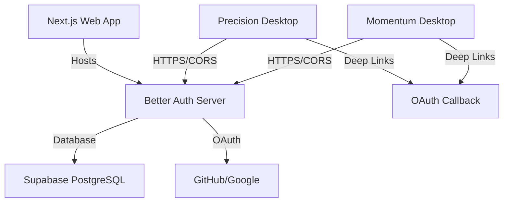
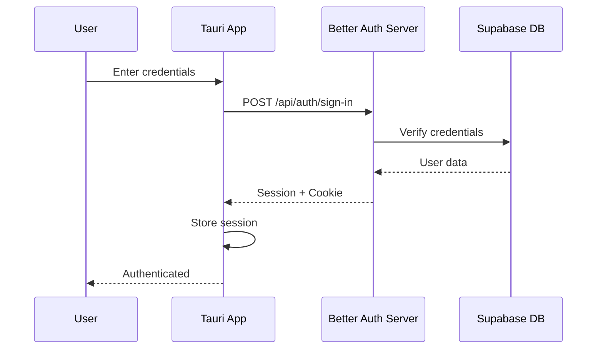
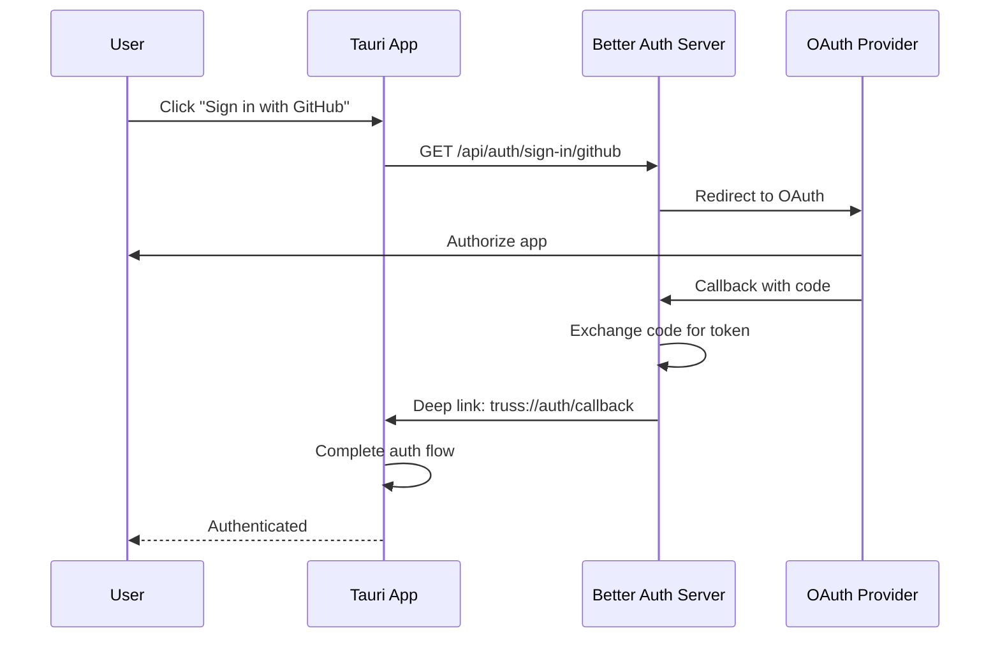

# Authentication Architecture

This document explains the authentication setup for the Truss monorepo, which includes a Next.js web app and two Tauri desktop applications (Precision & Momentum).

## Overview



## Architecture Components

### 1. Better Auth Server (Next.js)

The Next.js application serves dual purposes:

- **Marketing website** for downloading desktop apps
- **Authentication server** for all applications

**Location**: `apps/web/app/api/auth/[...all]/route.ts`

### 2. Tauri Desktop Apps

Both Precision and Momentum connect to the Better Auth server:

- **Local Development**: Connect to `http://localhost:3000`
- **Production**: Connect to `https://your-app.vercel.app`

### 3. Supabase Database

Better Auth uses Supabase PostgreSQL to store:

- User accounts
- Sessions
- Organizations
- Two-factor authentication data

## Setup Guide

### Local Development

1. **Start the authentication system**:

   ```bash
   # For Precision app (automatically starts Next.js server)
   bun run dev:precision

   # For Momentum app (automatically starts Next.js server)
   bun run dev:momentum
   ```

   The development scripts automatically:
   - Start the Next.js server (port 3000)
   - Start the Vite dev server (port 1420)
   - Wait for the auth server to be ready
   - Launch the Tauri app

2. **Environment Variables**:

   **Web App** (`apps/web/.env.local`):

   ```env
   DATABASE_URL=postgresql://...
   NEXT_PUBLIC_SUPABASE_URL=https://...
   NEXT_PUBLIC_SUPABASE_ANON_KEY=...
   ```

   **Desktop Apps** (`apps/[precision|momentum]/.env`):

   ```env
   VITE_BETTER_AUTH_URL=http://localhost:3000
   VITE_SUPABASE_URL=https://...
   VITE_SUPABASE_ANON_KEY=...
   ```

### Production Deployment

#### 1. Deploy Next.js to Vercel

1. **Set environment variables in Vercel**:

   ```env
   DATABASE_URL=postgresql://... (use transaction pooler URL)
   NEXT_PUBLIC_APP_URL=https://your-app.vercel.app
   NEXT_PUBLIC_SUPABASE_URL=https://...
   NEXT_PUBLIC_SUPABASE_ANON_KEY=...
   GITHUB_CLIENT_ID=... (optional)
   GITHUB_CLIENT_SECRET=... (optional)
   ```

2. **Deploy**:
   ```bash
   vercel deploy --prod
   ```

#### 2. Build Desktop Apps

1. **Update production environment**:

   Copy `.env.production` to `.env` and update:

   ```env
   VITE_BETTER_AUTH_URL=https://your-app.vercel.app
   ```

2. **Build the apps**:

   ```bash
   # Build Precision
   cd apps/precision
   bun run build
   bun run tauri build

   # Build Momentum
   cd apps/momentum
   bun run build
   bun run tauri build
   ```

## Authentication Flow

### 1. Email/Password Authentication



### 2. OAuth Authentication (GitHub/Google)



## Deep Links Configuration

Both Tauri apps are configured with the `truss://` scheme for OAuth callbacks:

**`tauri.conf.json`**:

```json
{
  "plugins": {
    "deep-link": {
      "desktop": {
        "schemes": ["truss"]
      }
    }
  }
}
```

## CORS Configuration

The Better Auth server includes CORS headers for desktop app access:

**Allowed Origins**:

- `http://localhost:1420` (development)
- `tauri://localhost` (production)
- `https://tauri.localhost` (production HTTPS)

## Security Considerations

### 1. PKCE Flow

Desktop apps use the PKCE (Proof Key for Code Exchange) flow for OAuth, which is more secure for public clients.

### 2. Secure Token Storage

Tokens are stored using Tauri's secure storage plugin (`@tauri-apps/plugin-store`).

### 3. Environment Variables

- **Never commit** `.env` files with real credentials
- Use `.env.example` files for documentation
- Store production secrets in Vercel environment variables

### 4. Supabase Anon Key

The Supabase anon key is safe to expose in client applications as it's designed for public use with Row Level Security (RLS).

## Troubleshooting

### Common Issues

1. **"Failed to load resource: Could not connect to the server"**
   - Ensure Next.js server is running on port 3000
   - Check VITE_BETTER_AUTH_URL in desktop app .env

2. **OAuth redirect not working**
   - Verify deep link scheme matches in all configs
   - Check OAuth provider callback URL configuration

3. **CORS errors**
   - Verify origin is in allowed list in API route
   - Check development mode is enabled

### Debug Mode

Enable debug logging in desktop apps:

```env
VITE_DEBUG_MODE=true
VITE_DEBUG_AUTH=true
```

## API Endpoints

Better Auth provides these endpoints (all under `/api/auth/`):

- `POST /sign-up` - Register new user
- `POST /sign-in` - Sign in with email/password
- `GET /sign-in/github` - GitHub OAuth
- `GET /sign-in/google` - Google OAuth
- `POST /sign-out` - Sign out
- `GET /get-session` - Get current session
- `POST /update-user` - Update user profile
- `POST /delete-user` - Delete account
- `POST /verify-email` - Verify email address
- `POST /forgot-password` - Request password reset
- `POST /reset-password` - Reset password

## Testing Authentication

### Local Testing

1. **Start the system**:

   ```bash
   bun run dev:precision
   ```

2. **Test sign-up**:
   - Open the app
   - Click "Sign Up"
   - Enter test credentials
   - Verify account creation in Supabase dashboard

3. **Test OAuth**:
   - Click "Sign in with GitHub"
   - Authorize in browser
   - Verify deep link callback works

### Production Testing

1. Deploy to Vercel
2. Update desktop app with production URL
3. Build and install desktop app
4. Test authentication flows

## Migration from Other Auth Systems

If migrating from another authentication system:

1. Export user data from old system
2. Import to Supabase using Better Auth migration tools
3. Update user passwords (require reset on first login)
4. Migrate OAuth provider registrations

## Support

For issues or questions:

- Check [Better Auth docs](https://better-auth.com)
- Check [Tauri docs](https://tauri.app)
- Review [Supabase Auth docs](https://supabase.com/docs/guides/auth)
