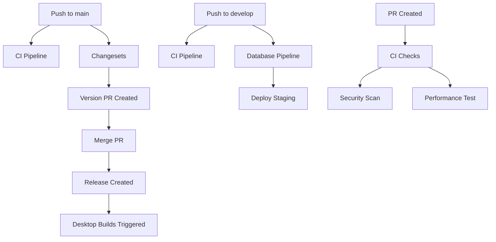

# CI/CD Pipeline Documentation

> **Silicon Valley-level CI/CD infrastructure for Truss monorepo**

This document describes the complete CI/CD pipeline setup for the Truss monorepo, including workflows, environments, and deployment strategies.

## 🏗️ Architecture Overview

```
┌─────────────────────────────────────────────────────────┐
│                     GitHub Actions                       │
├─────────────────────────────────────────────────────────┤
│                                                          │
│  ┌──────────────┐  ┌──────────────┐  ┌──────────────┐  │
│  │      CI      │  │   Database   │  │  Changesets  │  │
│  │   Pipeline   │  │  Migrations  │  │  Versioning  │  │
│  └──────────────┘  └──────────────┘  └──────────────┘  │
│                                                          │
│  ┌──────────────┐  ┌──────────────┐  ┌──────────────┐  │
│  │  Web Deploy  │  │Desktop Build │  │  Dependabot  │  │
│  │   (Vercel)   │  │   (Tauri)    │  │   Updates    │  │
│  └──────────────┘  └──────────────┘  └──────────────┘  │
│                                                          │
└─────────────────────────────────────────────────────────┘
```

## 📋 Workflows

### 1. **Continuous Integration** (`.github/workflows/ci.yml`)

**Trigger:** Pull requests, pushes to `main`/`develop`

**Jobs:**

- 🎯 **Quality Gate**: Linting, formatting, type checking
- 🧪 **Tests**: Parallel test execution with sharding
- 🏗️ **Build Matrix**: Builds all apps (web, precision, momentum)
- 🔒 **Security**: Dependency audit, secret scanning
- ⚡ **Performance**: Lighthouse CI for web app

**Features:**

- Selective builds based on changed files
- Turbo remote caching for speed
- Parallel matrix builds
- Comprehensive security scanning

### 2. **Database Migrations** (`.github/workflows/database.yml`)

**Trigger:** Changes to `supabase/**`, manual dispatch

**Environments:**

- Staging (on `develop` branch)
- Production (on `main` branch)

**Jobs:**

- ✅ **Validate**: SQL syntax checking, migration testing
- 🚀 **Deploy Staging**: Auto-deploy to staging Supabase
- 🚀 **Deploy Production**: Manual approval for production
- 💾 **Backup**: Automatic production backups

**Safety Features:**

- Migration validation on local Supabase
- Diff preview before production deploy
- Production reset protection
- Automatic type generation

### 3. **Changesets** (`.github/workflows/changesets.yml`)

**Trigger:** Push to `main` branch

**Jobs:**

- 📦 **Version & Release**: Automated versioning with Changesets
- 🏷️ **Tag Sync**: Automatic git tag creation
- 🚀 **Desktop Triggers**: Auto-trigger desktop app releases

**Features:**

- Independent versioning per app
- Automatic changelog generation
- GitHub releases with notes
- Downstream workflow triggers

### 4. **Web Deployment** (`.github/workflows/release-web.yml`)

**Trigger:** Push to `main`, tags `web-v*`, manual dispatch

**Environments:**

- Staging (preview deployments)
- Production (stable releases)

**Jobs:**

- 🏗️ **Build & Deploy**: Vercel deployment with environment config
- 📊 **Lighthouse**: Performance testing
- 💬 **PR Comments**: Deployment URL comments

### 5. **Desktop Releases** (`.github/workflows/release-desktop.yml`)

**Trigger:** Tags `precision-v*`, `momentum-v*`, manual dispatch

**Platforms:**

- macOS (universal binary)
- Windows (x86_64)
- Linux (x86_64)

**Jobs:**

- 🏗️ **Build Matrix**: Multi-platform builds
- 🔐 **Code Signing**: Apple & Windows signing
- 📦 **GitHub Release**: Installers & auto-updater JSON
- 🍺 **Homebrew**: Formula updates (macOS)

## 🔐 Required GitHub Secrets

### Repository Secrets

Add these secrets in: **Settings → Secrets and variables → Actions → New repository secret**

#### **Turbo Remote Cache**

```bash
TURBO_TOKEN=<your-turbo-token>
```

#### **Vercel Deployment**

```bash
VERCEL_TOKEN=<vercel-token>
VERCEL_ORG_ID=<org-id>
VERCEL_PROJECT_ID=<project-id>
```

#### **Supabase (Staging)**

```bash
STAGING_PROJECT_ID=<staging-project-ref>
STAGING_DB_PASSWORD=<staging-db-password>
```

#### **Supabase (Production)**

```bash
PRODUCTION_PROJECT_ID=<production-project-ref>
PRODUCTION_DB_PASSWORD=<production-db-password>
```

#### **Application Environment Variables**

```bash
# Backend
NEXT_PUBLIC_APP_URL=<app-url>
DATABASE_URL=<postgres-connection-string>
BETTER_AUTH_SECRET=<auth-secret>

# Frontend (Public)
NEXT_PUBLIC_SUPABASE_URL=<supabase-url>
NEXT_PUBLIC_SUPABASE_ANON_KEY=<supabase-anon-key>
```

#### **Desktop App Signing (Optional)**

```bash
# macOS
APPLE_CERTIFICATE=<base64-encoded-p12>
APPLE_CERTIFICATE_PASSWORD=<cert-password>
APPLE_SIGNING_IDENTITY=<signing-identity>
APPLE_ID=<apple-id>
APPLE_PASSWORD=<app-specific-password>
APPLE_TEAM_ID=<team-id>

# Windows
WINDOWS_SIGNING_CERTIFICATE=<base64-encoded-pfx>
WINDOWS_SIGNING_PASSWORD=<cert-password>

# Tauri Updates
TAURI_SIGNING_PRIVATE_KEY=<private-key>
TAURI_SIGNING_PUBLIC_KEY=<public-key>
```

#### **Notifications (Optional)**

```bash
SLACK_WEBHOOK_URL=<webhook-url>
DISCORD_WEBHOOK=<webhook-url>
```

### Repository Variables

Add these in: **Settings → Secrets and variables → Actions → Variables**

```bash
TURBO_TEAM=<your-team-slug>
```

## 🚀 Deployment Guide

### Web App Deployment

#### Staging

```bash
# Automatic on push to main
git push origin main

# Or manual dispatch
gh workflow run release-web.yml -f environment=staging
```

#### Production

```bash
# Manual dispatch with production environment
gh workflow run release-web.yml -f environment=production
```

### Desktop App Releases

#### Using Changesets (Recommended)

```bash
# 1. Add changeset
bunx changeset add

# 2. Commit changeset
git add .changeset
git commit -m "chore: add changeset for precision v1.2.0"
git push

# 3. Changesets workflow creates version PR
# 4. Merge PR → automatic release + desktop builds
```

#### Manual Release

```bash
# 1. Tag release
git tag -a precision-v1.0.0 -m "Release Precision v1.0.0"
git push origin precision-v1.0.0

# 2. Workflow builds for all platforms
# 3. Creates GitHub release with installers
```

#### Manual Dispatch

```bash
# Trigger specific app release
gh workflow run release-desktop.yml \
  -f app=precision \
  -f version=1.0.0
```

### Database Migrations

#### Staging (Automatic)

```bash
# Push to develop branch
git checkout develop
git add supabase/migrations/
git commit -m "feat: add new migration"
git push origin develop

# Workflow validates and deploys to staging
```

#### Production (Manual Approval)

```bash
# Push to main branch
git checkout main
git merge develop
git push origin main

# Workflow requires manual approval in GitHub UI
# Navigate to Actions → Database Pipeline → Review deployment
```

#### Manual Migration

```bash
# Manual dispatch with specific action
gh workflow run database.yml \
  -f environment=staging \
  -f action=migrate
```

## 🔄 Workflow Dependencies



## 📊 Monitoring & Observability

### Build Status Badges

Add to README.md:

```markdown
[](https://github.com/forerelic/truss/actions)
[](https://github.com/forerelic/truss/actions)
```

### Workflow Runs

- **View all workflows**: https://github.com/forerelic/truss/actions
- **CI runs**: https://github.com/forerelic/truss/actions/workflows/ci.yml
- **Deployments**: Settings → Environments

### Deployment URLs

- **Production**: Configured in Vercel
- **Staging**: Preview deployments on PRs
- **Desktop releases**: GitHub Releases page

## 🛠️ Troubleshooting

### Common Issues

#### **CI Fails: "TURBO_TOKEN not set"**

**Solution:** Add `TURBO_TOKEN` to repository secrets

#### **Vercel Deployment Fails**

**Solution:**

1. Verify `VERCEL_TOKEN`, `VERCEL_ORG_ID`, `VERCEL_PROJECT_ID` are set
2. Check Vercel project is linked correctly
3. Verify deployment quota not exceeded

#### **Desktop Build Fails: "Rust toolchain not found"**

**Solution:** Ensure `dtolnay/rust-toolchain@stable` action is running

#### **Database Migration Fails**

**Solution:**

1. Check migration SQL syntax
2. Verify Supabase credentials
3. Review migration validation logs
4. Ensure local Supabase is running for tests

#### **Changesets Not Creating PR**

**Solution:**

1. Ensure changesets exist in `.changeset/` directory
2. Verify `GITHUB_TOKEN` has write permissions
3. Check branch protection allows bot PRs

### Debug Mode

Enable verbose logging:

```yaml
# Add to workflow env:
TURBO_VERBOSITY: 2
ACTIONS_STEP_DEBUG: true
```

## 🎯 Best Practices

### Commits

- Use conventional commits: `feat:`, `fix:`, `chore:`
- Keep commits atomic and focused
- Reference issues: `fix: resolve #123`

### Changesets

- Add changeset for every user-facing change
- Choose correct semver bump (major/minor/patch)
- Write clear changelog descriptions

### Releases

- Use semantic versioning (semver)
- Test staging before production
- Monitor deployment in GitHub Actions
- Verify builds in GitHub Releases

### Security

- Rotate secrets regularly
- Use least-privilege access
- Review Dependabot PRs promptly
- Monitor security scan results

## 📚 Additional Resources

- [Turborepo Remote Caching](https://turbo.build/repo/docs/core-concepts/remote-caching)
- [Changesets Documentation](https://github.com/changesets/changesets)
- [GitHub Actions Docs](https://docs.github.com/en/actions)
- [Tauri CI/CD Guide](https://tauri.app/v1/guides/building/cross-platform)
- [Vercel Deployment](https://vercel.com/docs/deployments/git)

---

**Need Help?** Open an issue: https://github.com/forerelic/truss/issues/new
